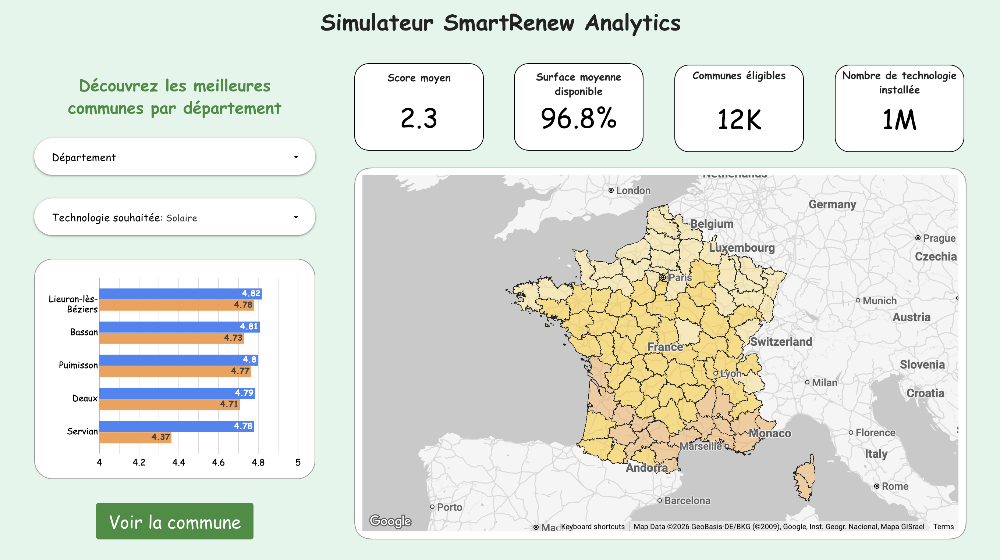
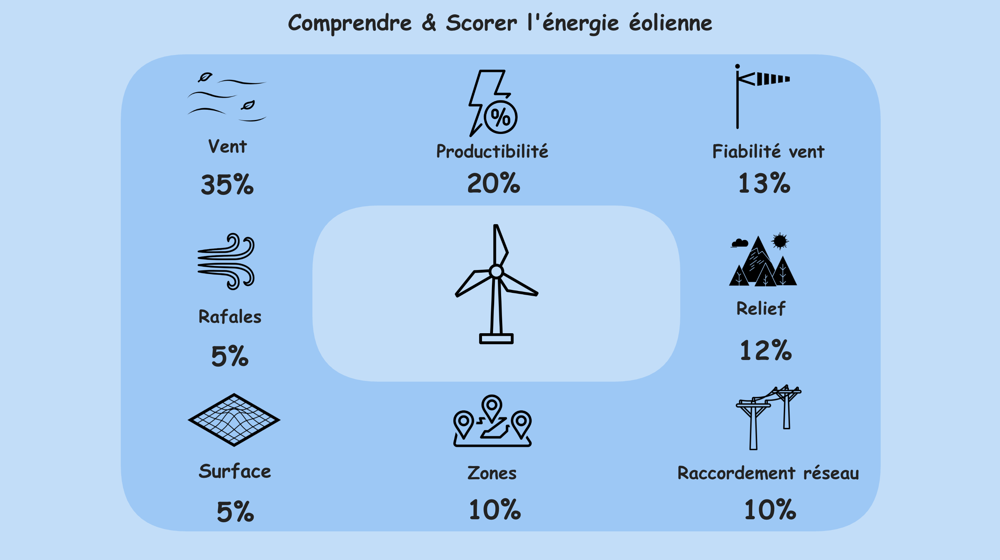
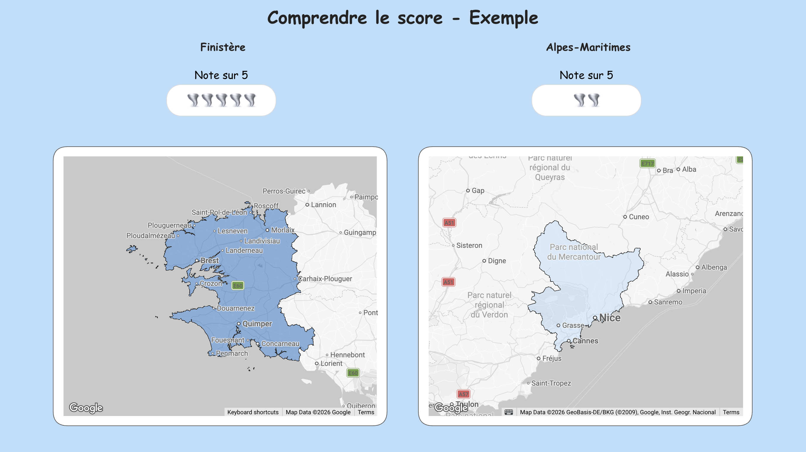
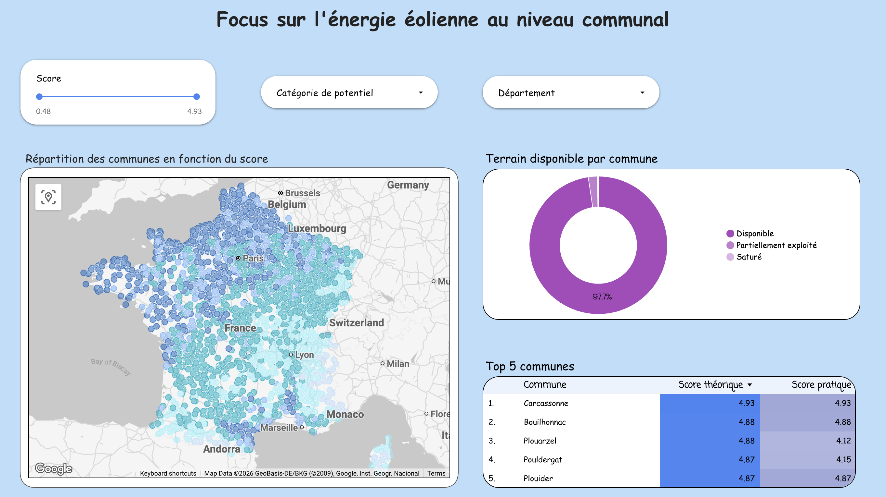
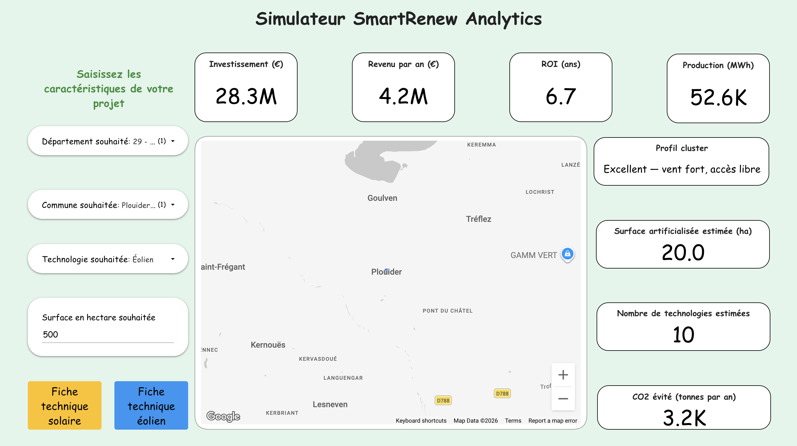
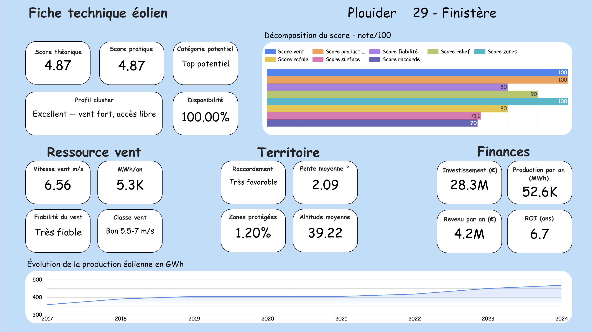

<div align="center">

# ☀️🌬️ SmartRenew Analytics

### Un moteur d'intelligence territoriale pour accélérer le déploiement des énergies renouvelables en France


*Identifier, parmi les ~35 000 communes françaises, celles au meilleur potentiel solaire et éolien — en conciliant ressource, territoire et rentabilité.*

[Dashboard interactif](#) · [Documentation](#-table-des-matières) · [Équipe](#-équipe)

<br>

<!-- 📸 Capture principale : page de titre OU carte de France colorée (page 11/16 du dashboard) -->


</div>

---

## 📋 Table des matières

- [Aperçu](#-aperçu)
- [Contexte & problématique](#-contexte--problématique)
- [Fonctionnalités](#-fonctionnalités)
- [Architecture & stack technique](#-architecture--stack-technique)
- [Structure du repository](#-structure-du-repository)
- [Installation & usage](#-installation--usage)
- [Données](#-données)
- [Méthodologie de scoring](#-méthodologie-de-scoring)
- [Machine Learning](#-machine-learning)
- [Le dashboard](#-le-dashboard)
- [Résultats clés](#-résultats-clés)
- [Limites & hypothèses](#-limites--hypothèses)
- [Pistes d'évolution](#-pistes-dévolution)
- [Équipe](#-équipe)

---

## 🔭 Aperçu

**SmartRenew Analytics** est un projet data de bout en bout qui analyse le potentiel des énergies renouvelables (solaire et éolien) de chaque commune française, du niveau national jusqu'à la parcelle.

Le projet couvre l'ensemble de la chaîne de valeur data : **ingestion et transformation** de sources publiques (dbt + BigQuery), **scoring** multicritère par commune, **Machine Learning** (clustering + projections), et **restitution** via un dashboard interactif (Looker Studio) incluant un simulateur de projet.

---

## 🎯 Contexte & problématique

La France s'est engagée à **doubler ses capacités solaires et éoliennes d'ici 2035** (PPE3). Le potentiel physique existe largement : le vrai frein est de savoir **où** implanter les projets.

Or un porteur de projet — développeur, collectivité, investisseur — doit aujourd'hui croiser des données dispersées (ensoleillement, vent, contraintes réglementaires, foncier, raccordement) sans outil unifié pour comparer les territoires à l'échelle de la commune.

> **Comment identifier, parmi les ~35 000 communes françaises, celles au meilleur potentiel solaire et éolien, en conciliant ressource, territoire et rentabilité ?**

SmartRenew Analytics répond à ce besoin en agrégeant des données publiques pour produire un **score de pertinence d'implantation par commune**, accessible via un dashboard interactif et un simulateur de projet.

---

## ✨ Fonctionnalités

- 🗺️ **Score de potentiel par commune** (solaire et éolien) sur 100, restitué sur 5 pour le grand public, calculé à partir de 8 critères pondérés par technologie.
- 🌍 **Cartographie interactive** du national au communal (cartes choroplèthes départementales + cartes à bulles communales).
- 🏆 **Classements** Top 5 / Flop 5 des départements et communes.
- 🧩 **Profils types** de communes via clustering (Machine Learning).
- 📈 **Projections de production** à 2030, 2035 et 2040.
- 🧮 **Simulateur de projet** : commune + technologie + surface → production, investissement, ROI, CO₂ évité, nombre d'éoliennes/panneaux.
- 📑 **Fiches techniques détaillées** par commune et par technologie (décomposition du score, ressource, territoire, finances, historique).

<!-- 📸 Optionnel : capture de la page "Comprendre & Scorer" (les pétales avec pourcentages, page 8 ou 13) -->
<div align="center">



</div>

---

## 🏗️ Architecture & stack technique

```
                          SOURCES PUBLIQUES
        (météo · PVGIS · relief · foncier · RTE · installations ENR)
                                  │
                                  ▼
        ┌────────────────────────────────────────────────────┐
        │                  dbt + BigQuery (EU)               │
        │                                                    │
        │   Staging  ──>  Intermediate  ──>     Marts        │
        │  (nettoyage)    (features)      (score & dashboard)│
        └────────────────────────────────────────────────────┘
                                  │
                  ┌───────────────┴────────────────┐
                  ▼                                ▼
       ┌────────────────────┐          ┌─────────────────────┐
       │  Machine Learning  │          │   Vues de service   │
       │  (Python/sklearn)  │ ───────> │   (mart_*_ml, etc.) │
       │  clustering +      │          │                     │
       │  régression        │          └─────────────────────┘
       └────────────────────┘                      │
                                                   ▼
                                       ┌────────────────────┐
                                       │    Looker Studio   │
                                       │  Dashboard + outil │
                                       └────────────────────┘
```

| Couche | Outils |
|---|---|
| **Transformation des données** | dbt, BigQuery |
| **Machine Learning** | Python, scikit-learn, pandas, numpy |
| **Visualisation** | Looker Studio (Google Maps pour les cartes) |
| **Orchestration / versionning** | dbt Cloud, Git/GitHub |

**Modélisation dbt en couches :**
- **Staging** : nettoyage et standardisation des sources (vent converti en m/s et extrapolé à 100 m, dédoublonnage, gestion des valeurs aberrantes…).
- **Intermediate** : construction des features (météo, énergie, territoire, production annuelle).
- **Marts** : tables analytiques finales et vues de restitution.

---

## 📁 Structure du repository

```
smartrenew-analytics/
├── dbt_project/
│   ├── models/
│   │   ├── staging/              # nettoyage des sources
│   │   │   ├── stg_meteo.sql
│   │   │   ├── stg_pvgis.sql
│   │   │   ├── stg_relief_commune.sql
│   │   │   ├── stg_prix_terrain_dept.sql
│   │   │   └── ...
│   │   ├── intermediate/         # construction des features
│   │   │   ├── int_features_meteo.sql
│   │   │   ├── int_features_energie.sql
│   │   │   ├── int_features_territoire.sql
│   │   │   └── int_features_production_annuelle.sql
│   │   └── marts/                # tables & vues finales
│   │       ├── mart_features_communes.sql
│   │       ├── mart_score_communes.sql
│   │       ├── mart_dashboard.sql
│   │       ├── mart_dashboard_national.sql
│   │       ├── mart_dashboard_dept.sql
│   │       ├── mart_dashboard_ml.sql
│   │       └── mart_evolution_*.sql
│   ├── dbt_project.yml
│   └── profiles.yml
├── ml/
│   ├── clustering.py             # K-Means (profils communes)
│   ├── regression.py             # projections 2030/2035/2040
│   └── requirements.txt
├── docs/                         # guides de construction du dashboard
├── assets/                       # logo, captures d'écran
└── README.md
```

---

## ⚙️ Installation & usage

> ℹ️ **Note** : ce repository contient le code source du pipeline (modèles dbt, scripts ML).
> Le projet s'appuie sur des sources de données hébergées dans un projet **BigQuery privé** ;
> il n'est donc pas reproductible en l'état sans accès à ces données et à un environnement
> Google Cloud configuré. Les étapes ci-dessous décrivent le fonctionnement du pipeline.

### Prérequis

- Python 3.10+
- Un projet Google Cloud avec BigQuery activé et les datasets sources
- dbt (`dbt-bigquery`)
- Une clé de service Google Cloud (JSON)

### 1. Cloner le repository

```bash
git clone https://github.com/<votre-org>/smartrenew-analytics.git
cd smartrenew-analytics
```

### 2. Configurer l'environnement Python

```bash
python -m venv .venv
source .venv/bin/activate        # Windows : .venv\Scripts\activate
pip install -r ml/requirements.txt
```

### 3. Configurer l'accès BigQuery

```bash
export GOOGLE_APPLICATION_CREDENTIALS="/chemin/vers/votre-cle.json"
```

### 4. Lancer le pipeline dbt

```bash
cd dbt_project
dbt deps
dbt run                          # construit staging → intermediate → marts
dbt test                         # (optionnel) tests de qualité
```

> ⚠️ Ordre des dépendances : `mart_score_communes` doit être construit avant `mart_dashboard`, lui-même avant les vues de service.

### 5. Lancer le Machine Learning

```bash
cd ../ml
python clustering.py             # génère les profils (cluster + nom)
python regression.py             # génère les projections 2030/2035/2040
```

> Les résultats sont écrits dans `mart_ml_communes`. La vue `mart_dashboard_ml` doit ensuite être recréée pour joindre dashboard + ML.

### 6. Visualiser

Le dashboard Looker Studio se branche directement sur les vues BigQuery (`mart_dashboard_ml`, `mart_dashboard_national`, `mart_dashboard_dept`, `mart_evolution_*`).
---

## 📊 Données

Cinq familles de données publiques pour une vision 360° :

| Famille | Contenu |
|---|---|
| **Données solaires** | Irradiation globale, production PVGIS, exposition des surfaces, couverture nuageuse |
| **Données éoliennes** | Vitesse et régularité des vents, rafales, données altimétriques |
| **Géographie** | Occupation des sols, relief, pentes, zones protégées (Natura 2000, ZNIEFF, parcs…) |
| **Réseau électrique** | Infrastructures RTE, proximité des postes sources, capacité de raccordement |
| **Données économiques** | Prix du foncier, consommation locale, tarifs de rachat, production installée |

Les agrégats nationaux sont validés contre les bilans officiels **RTE**.

---

## 🧮 Méthodologie de scoring

Chaque commune reçoit deux scores sur 100 (affichés sur 5), combinant 8 critères pondérés.

<table>
<tr><th>☀️ Score solaire</th><th>🌬️ Score éolien</th></tr>
<tr><td>

| Critère | Poids |
|---|---|
| Production PVGIS | 30 % |
| Irradiation | 22 % |
| Zones protégées | 15 % |
| Exposition | 12 % |
| Pente du terrain | 8 % |
| Surface disponible | 5 % |
| Raccordement réseau | 5 % |
| Couverture nuageuse | 3 % |

</td><td>

| Critère | Poids |
|---|---|
| Vent | 35 % |
| Productibilité | 20 % |
| Fiabilité du vent | 13 % |
| Relief | 12 % |
| Zones protégées | 10 % |
| Rafales | 5 % |
| Surface | 5 % |
| Raccordement réseau | 5 % |

</td></tr>
</table>

**Éligibilité** (bon score ET surface installable) :
- Solaire : score ≥ 50 et surface > 0
- Éolien : score ≥ 60 et surface > 0 *(seuil calé sur un vent réellement exploitable ≥ 5 m/s)*

**Score ajusté** : un score « pratique » pondéré par la disponibilité foncière (`score × disponibilité`) distingue le potentiel théorique du potentiel réellement exploitable.

**Classes de potentiel** : Top potentiel · Bon potentiel · Non éligible.

<!-- 📸 Capture des exemples de scoring (page 9 ou 14 : Finistère vs Alpes-Maritimes en étoiles) -->
<div align="center">



</div>

---

## 🤖 Machine Learning

Deux volets développés en Python (scikit-learn) :

### Clustering — K-Means (k=6 par technologie)
Regroupe les ~35 800 communes en familles types selon leurs caractéristiques (score, ressource, foncier, contraintes). Exemples de profils :
- ⭐ *Excellent vent — accès libre*
- 🛡️ *Zone protégée — faible potentiel*
- 🏞️ *Vaste foncier — projets d'envergure*

Ce clustering alimente la recommandation de **communes alternatives** au même profil lorsqu'une cible est saturée.

### Régression linéaire — projection temporelle
Projette la production de chaque commune à horizon **2030 / 2035 / 2040** à partir de la tendance 2017-2024.

> **R² moyen = 0,64** — projection tendancielle assumée : la production évolue par paliers d'installation, ce qui plafonne mécaniquement le R². Le R² par commune est fourni comme indicateur de fiabilité.

---

## 📈 Le dashboard

Construit en **Looker Studio**, organisé en logique « entonnoir » :

```
Toutes énergies → Renouvelables → Éolien → Solaire → Outil
```

1. **Contexte** — problématique, mix électrique français 2024, place et montée des ENR.
2. **Analyse éolienne** — scoring, classements Top/Flop, focus départemental et communal.
3. **Analyse solaire** — idem.
4. **Outil SmartRenew** — simulateur de projet interactif, profils ML, fiches techniques par commune (avec navigation et filtres propagés entre pages).

### Aperçu visuel

<div align="center">

<!-- 📸 Captures AVEC une commune sélectionnée (pour éviter les agrégats nationaux) -->

| Carte de potentiel | Simulateur de projet |
|:---:|:---:|
|  |  |

| Fiche technique commune |
|:---:|
|  |

</div>

---

## 🔑 Résultats clés

- **~35 792 communes** analysées, scorées et classées (solaire + éolien).
- Le **potentiel réaliste** (avec contraintes d'acceptabilité, réseau et foncier) **dépasse les objectifs nationaux PPE3 2035** — confirmant que le frein principal est le rythme de déploiement, pas la ressource.
- **ROI réalistes** : ~10 ans pour le solaire, ~14 ans pour l'éolien (tarifs marché 2025).
- **Distinction emprise / espacement** pour l'éolien : ~2 ha artificialisés par éolienne contre ~50 ha d'espacement — le foncier reste largement cultivable.

---

## ⚠️ Limites & hypothèses

Par souci de transparence méthodologique :

- **Vent extrapolé** de 10 m à 100 m (hauteur de nacelle) via la loi de Hellmann (α = 0,14).
- **Prix du foncier** disponible à la maille départementale, appliqué aux communes (données agricoles publiques).
- **Production communale reconstruite** à partir des capacités installées × facteur de charge — léger écart avec RTE (l'éolien variant selon les conditions de vent annuelles).
- **Projection ML** = régression tendancielle (les caractéristiques de la commune étant constantes dans le temps, ajouter des features n'améliorerait pas le R²).
- **Potentiel réaliste** : taux de mobilisation de 5 % (solaire) et 8 % (éolien) calés sur la PPE3.
- **Tarifs de rachat** : 88 €/MWh solaire, 80 €/MWh éolien (marché 2025).
- **Périmètre de consommation** : données Enedis (~93 % du national RTE).

---

## 🚀 Pistes d'évolution

- Affiner l'estimation à une maille plus fine que la commune (parcelle).
- Intégrer les **files d'attente de raccordement** réseau (délais réels).
- Enrichir le simulateur avec des **scénarios de financement** (autoconsommation, vente totale, PPA).
- Étendre l'analyse à d'autres filières (géothermie, méthanisation).
- Industrialiser le pipeline ML (orchestration, ré-entraînement automatique).

---

## 👥 Équipe

Projet réalisé dans le cadre de la formation **Data Analytics du Wagon**.

| | |
|---|---|
| **Tony Delphin** | [LinkedIn](#) |
| **William Pereira** | [LinkedIn](https://www.linkedin.com/in/william-pereira-976569292/?lipi=urn%3Ali%3Apage%3Ad_flagship3_profile_view_base_contact_details%3BSyfqcW6YS%2B%2BFHnFkjQwyvg%3D%3D) |
| **Alexis Moricci** | [LinkedIn](https://www.linkedin.com/in/alexis-moricci/?lipi=urn%3Ali%3Apage%3Ad_flagship3_profile_view_base_contact_details%3BaDcjaHz%2FSZaEMMKyt7Ofkg%3D%3D) |
| **Félix Ortiz Gonthier** | [LinkedIn](www.linkedin.com/in/ortiz-gonthier-felix) |

---

<div align="center">

*SmartRenew Analytics — un outil data au service de la transition énergétique territoriale.* 🌍

</div>
